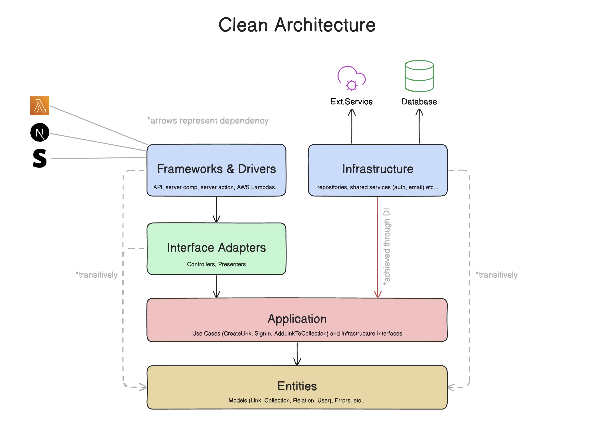

# Clean Architecture in Next.js

This repo is an example of how to achieve Clean Architecture in Next.js. There's
a video tutorial that goes through this project. Click on the image to check it
out on YouTube:

You can run the project just by running `npm install` and `npm run dev`.

## Clean Architecture

> [!NOTE]
> 👆 I drew this simplified version of the [original Clean Architecture diagram](https://blog.cleancoder.com/uncle-bob/2012/08/13/the-clean-architecture.html).
> I simplified it in a way that makes more sense to me, and it's easier to
> comprehend. I hope it helps you too.

I strongly recommend you to read
[the original article by Uncle Bob](https://blog.cleancoder.com/uncle-bob/2012/08/13/the-clean-architecture.html)
if this is your first time hearing about Clean Architecture, but I'll try to
summarize it for you below.

Clean Architecture is a _set of rules_ that help us structure our applications
in such way that they're easier to maintain and test, and their codebases are
predictable. It's like a common language that developers understand, regardless
of their technical backgrounds and programming language preferences.

Clean Architecture, and similar/derived architectures, all have the same goal -
_separation of concerns_. They introduce **layers** that bundle similar code
together. The "layering" helps us achieve important aspects in our codebase:

- **Independent of UI** - the business logic is not coupled with the UI
  framework that's being used (in this case Next.js). The same system can be
  used in a CLI application, without having to change the business logic or
  rules.
- **Independent of Database** - the database implementation/operations are
  isolated in their own layer, so the rest of the app does not care about which
  database is being used, but communicates using _Models_.
- **Independent of Frameworks** - the business rules and logic simply don't know
  anything about the outside world. They receive data defined with plain
  JavaScript, use plain JavaScript, _Services_ and _Repositories_ to define
  their own logic and functionality. This allows us to use frameworks as tools,
  instead of having to "mold" our system into their implementations and
  limitations. If we use Route Handlers in our app, and want to refactor some of
  them to Server Actions, all we need to do is just invoke the specific
  _controllers_ in a server action instead of a route handler, but the _core_
  business logic remains unchanged.
- **Testable** - the business logic and rules can easily be tested because it
  does not depend on the UI framework, or the database, or the web server, or
  any other external element that builds up our system.

Clean Architecture achieves this through defining a _dependency hierarchy_ -
layers depend only on layers **below them**, but not above.

## Project structure (only the important bits)

- `app` - **Frameworks & Drivers Layer** - basically everything Next.js (pages,
  server actions, components, styles etc...) or whatever "consumes" the app's
  logic
- `di` - Dependency Injection - a folder where we setup the DI container and the
  modules
- `drizzle` - Everything DB - initializing the DB client, defining schema,
  migrations
- `src` - The "root" of the system
  - `application` - **Application Layer** - holds use cases and interfaces for
    repositories and services
  - `entities` - **Entities Layer** - holds models and custom errors
  - `infrastructure` - **Infrastructure Layer** - holds implementations of
    repositories and services, and pulls in the interfaces from `application`
  - `interface-adapters` - **Interface Adapters Layer** - holds controllers that
    serve as an entry point to the system (used in Frameworks & Drivers layer to
    interact with the system)
- `tests` - Unit tests live here - the `unit` subfolder's structure matches
  `src`
- `.eslintrc.json` - Where the `eslint-plugin-boundaries` plugin is defined -
  _this stops you from breaking the dependency rule_
- `vitest.config.ts` - Take note of how the `@` alias is defined!

## Layers explanation

- **Frameworks & Drivers**: keeps all the UI framework functionality, and
  everything else that interacts with the system (ex. AWS Lambdas, Stripe
  webhooks etc...). In this scenario, that's Next.js Route Handlers, Server
  Actions, Components (Server and Client), Pages, Design System, etc...
  - This layer should only use _Controllers_, _Models_, and _Errors_, and **must
    not** use _Use Cases_, _Repositories_, and _Services_.
- **Interface Adapters**: defines _Controllers_:
  - Controllers perform **authentication checks** and **input validation**
    before passing the input to the specific use cases.
  - Controllers _orchestrate_ Use Cases. They don't implement any logic, but
    define the whole operations using use cases.
  - Errors from deeper layers are bubbled up and being handled where controllers
    are being used.
  - Controllers use _Presenters_ to convert the data to a UI-friendly format
    just before returning it to the "consumer". This helps us ship less
    JavaScript to the client (logic and libraries to convert the data), helps
    prevent leaking any sensitive properties, like emails or hashed passwords,
    and also helps us slim down the amount of data we're sending back to the
    client.
- **Application**: where the business logic lives. Sometimes called _core_. This
  layer defines the Use Cases and interfaces for the services and repositories.
  - **Use Cases**:
    - Represent individual operations, like "Create Todo" or "Sign In" or
      "Toggle Todo".
    - Accept pre-validated input (from controllers) and _handle authorization
      checks_.
    - Use _Repositories_ and _Services_ to access data sources and communicate
      with external systems.
    - **Use cases should not use other use cases**. That's a code smell. It
      means the use case does multiple things and should be broken down into
      multiple use cases.
  - Interfaces for Repositories and Services:
    - These are defined in this layer because we want to break out the
      dependency of their tools and frameworks (database drivers, email services
      etc...), so we'll implement them in the _Infrastructure_ layer.
    - Since the interfaces live in this layer, use cases (and transitively the
      upper layers) can access them through _Dependency Injection_.
    - _Dependency Injection_ allows us to split up the **definitions**
      (interfaces) from the **implementations** (classes) and keep them in a
      separate layer (infrastructure), but still allow their usage.
- **Entities**: where the _Models_ and _Errors_ are defined.
  - **Models**:
    - Define "domain" data shapes with plain JavaScript, without using
      "database" technologies.
    - Models are not always tied to the database - sending emails require an
      external email service, not a database, but we still need to have a data
      shape that will help other layers communicate "sending an email".
    - Models also define their own validation rules, which are called
      "Enterprise Business Rules". Rules that don't usually change, or are least
      likely to change when something _external_ changes (page navigation,
      security, etc...). An example is a `User` model that defines a username
      field that must be _at least 6 characters long and not include special
      characters_.
  - **Errors**:
    - We want our own errors because we don't want to be bubbling up
      database-specific errors, or any type of errors that are specific to a
      library or framework.
    - We `catch` errors that are coming from other libraries (for example
      Drizzle), and convert those errors to our own errors.
    - That's how we can keep our _core_ independent of any frameworks,
      libraries, and technologies - one of the most important aspects of Clean
      Architecture.
- **Infrastructure**: where _Repositories_ and _Services_ are being defined.
  - This layer pulls in the interfaces of repositories and services from the
    _Application Layer_ and implements them in their own classes.
  - _Repositories_ are how we implement the database operations. They are
    classes that expose methods that perform a single database operation - like
    `getTodo`, or `createTodo`, or `updateTodo`. This means that we use the
    database library / driver in these classes only. They don't perform any data
    validation, just execute queries and mutations against the database and
    either throw our custom defined _Errors_ or return results.
  - _Services_ are shared services that are being used across the application -
    like an authentication service, or email service, or implement external
    systems like Stripe (create payments, validate receipts etc...). These
    services also use and depend on other frameworks and libraries. That's why
    their implementation is kept here alongside the repositories.
  - Since we don't want any layer to depend on this one (and transitively depend
    on the database and all the services), we use the
    [_Dependency Inversion principle_](https://en.wikipedia.org/wiki/Dependency_inversion_principle).
    This allows us to depend only on the interfaces defined in the _Application
    Layer_, instead of the implementations in the _Infrastructure Layer_. We use
    an
    [_Inversion of Control_](https://en.wikipedia.org/wiki/Inversion_of_control)
    library like [ioctopus](https://github.com/Evyweb/ioctopus) to abstract the
    implementation behind the interfaces and "inject" it whenever we need it. We
    create the abstraction in the `di` directory. We "bind" the repositories,
    services, controllers, and use cases to Symbols, and we "resolve" them using
    those symbols when we need the actual implementation. That's how we can use
    the implementation, without needing to explicitly depend on it (import it).

## FAQ

> [!TIP]
> If you have a question not covered by the FAQ, feel free to either [open an Issue](https://github.com/nikolovlazar/nextjs-clean-architecture/issues/new)
> in this repo, or join [my Discord server](https://creatures.sh) and start a
> conversation there.

  
<b>Is Clean Architecture / this implementation serverless-friendly? Can I deploy this to Vercel?</b>

Yes! You can use it with Page Router, App Router, Middleware, API Handlers,
Server Actions, anything really! Usually, achieving Dependency Injection in
JavaScript projects is being done with the [Inversify.js](https://inversify.io)
library, which is incompatible with other runtimes except Node. This project
implements [ioctopus](https://github.com/Evyweb/ioctopus), a simple IoC
container that doesn't rely on `reflect-metadata` and works on all runtimes.

  
<b>Should I start implementing Clean Architecture immediately when I create my Next.js project?</b>

I'd say **no**. If you're starting a brand new project, I'd advise you to focus
on achieving an MVP status as fast as possible (so you can validate your idea /
see if there's a future for your project). When things start to get serious
(more features start to get implemented, your user base experiences a
significant growth, or you're onboarding other developers in your project),
that's when you'd want to invest some time into adapting this architecture (or
any architecture for that matter).

If you're already deep in the weeds on a project, you (and your team) can plan
for gradual refactoring starting from the next sprint. In this case you already
have the code written, you just need to reorganize it a little bit, and you can
do that part by part, route handler by route handler, server action by server
action. By the way, I say it lightly _"you just need to reorganize it a little
bit"_, but it can be far from being as simple as that. Always take into account
"things going wrong" when you plan the refactoring. And put some time in for
writing tests!

<b>This looks like overengineering, and complicates feature development.</b>

If you don't spend more than 3 minutes thinking about this, then yes, it does
look like overengineering. But if you do, you'll realize that **architecture =
discipline**. The architecture is a contract between the developers that defines
what goes where. It actually **simplifies** the feature development because it
makes the codebase predictable, and it makes those decisions for you.

You can't grow a project sustainably if every developer working on it writes
code where it's the most convenient. The codebase will turn into a nightmare to
work with, and that's when you'll feel a real complicated feature development
process. To battle this, eventually you will put down some rules. Those rules
will grow as your team faces and solves new issues. Put all those rules in a
document, and there's your very own architecture definition. You still implement
some sort of an architecture, you just reached that point very slowly and
painfully.

Clean Architecture gives you a shortcut and a predefined architecture that's
been tested. And yes, sure, you do need to learn all of this, but you do it once
in your lifetime, and then just apply the principles in any language or
framework you'll be using in future.

<b>Should I apply Clean Architecture in all of my projects?</b>

**No**. Not if you don't expect the project to grow, both in number of features,
or number of users, or number of developers working on it.

  
<b>What are other similar architectures to Clean Architecture?</b>

As mentioned in the
[original blog post](https://blog.cleancoder.com/uncle-bob/2012/08/13/the-clean-architecture.html)
I mentioned at the top of the README, you got:

- [Hexagonal Architecture](https://alistair.cockburn.us/hexagonal-architecture/)
  (a.k.a. Ports and Adapters) by Alistair Cockburn
- [Onion Architecture](https://jeffreypalermo.com/2008/07/the-onion-architecture-part-1/)
  by Jeffrey Palermo
- [Screaming Architecture](https://blog.cleancoder.com/uncle-bob/2011/09/30/Screaming-Architecture.html)
  by Uncle Bob (the same guy behind Clean Architecture)
- And a couple more (check out the original blog post)

